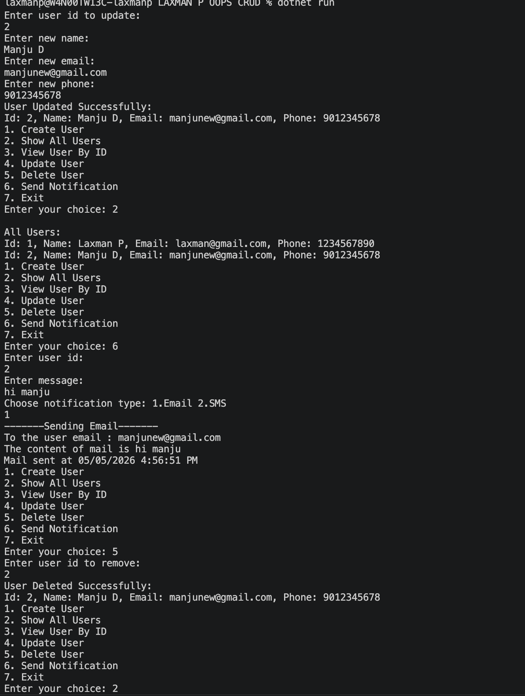

# NotificationApp

It is built to demonstrate basic OOP concepts such as abstraction, inheritance, polymorphism, and encapsulation along with Repository pattern.

## Features

- Create a user with name, email, and phone number
- Update User by id
- Get user by id
- Display all saved users
- Send a notification to a selected user
- Supports Email and SMS notification types

## How It Works

The app starts with a menu-driven console interface:

1. Create User
2. Show All Users
3. View User By ID
4. Update User
5. Delete User
6. Send Notification
7. Exit

User data is stored in memory during runtime, and notifications are handled through a common interface.

## Output Screenshot

