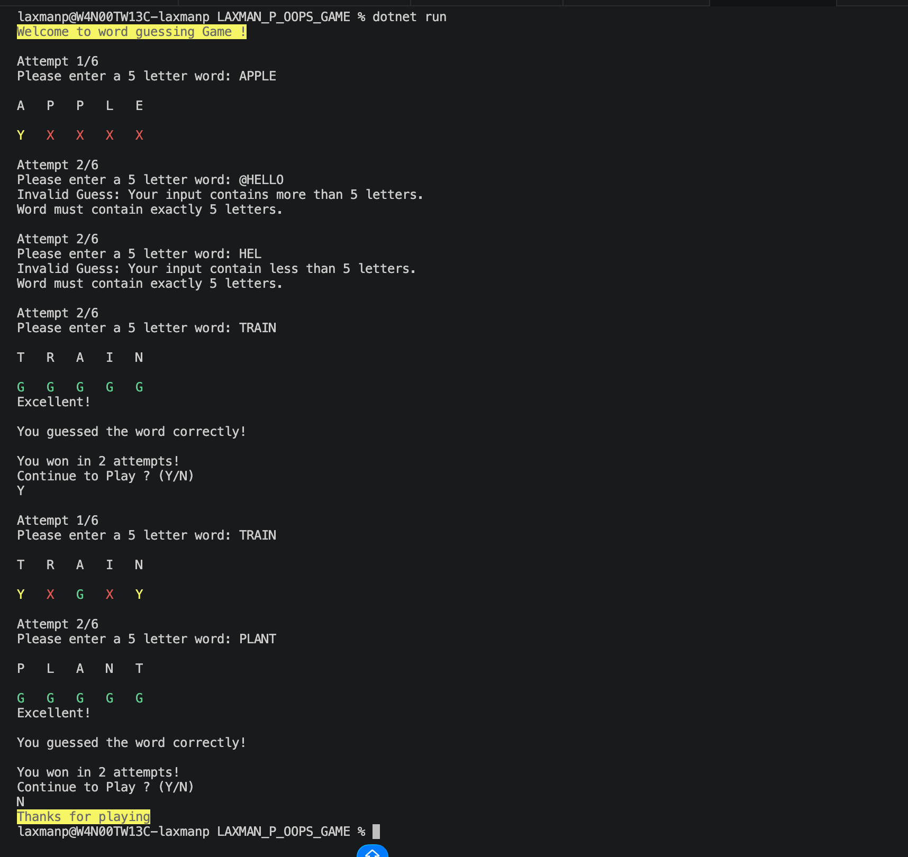

# C# Word Guessing Game

#### Build a console-based word guessing game similar to Wordle using C#, Object-Oriented Programming (OOP), and Exception Handling.

## Game Rules:

- The system should chooses one 5-letter word.
- The player gets a maximum of 6 attempts.
- The user can enter one guess per attempt.
- If the word is guessed correctly, the game ends immediately and asks users whether they are ready to play again.

## Feedback Rules

- G = Correct letter in correct position (GREEN)
- Y = Correct letter in wrong position (YELLOW)
- X = Letter not present in the word (RED)

## Exception Handling

*Exception Handling Implemented*
- Empty input
- Input less than 5 letters
- Input greater than 5 letters
- Input containing numbers
- Input containing special characters

## Bonus requirements implemented:
- Replay option
- Color output using Console.ForegroundColor
- Prevent Duplicate guesses
## Sample Output

