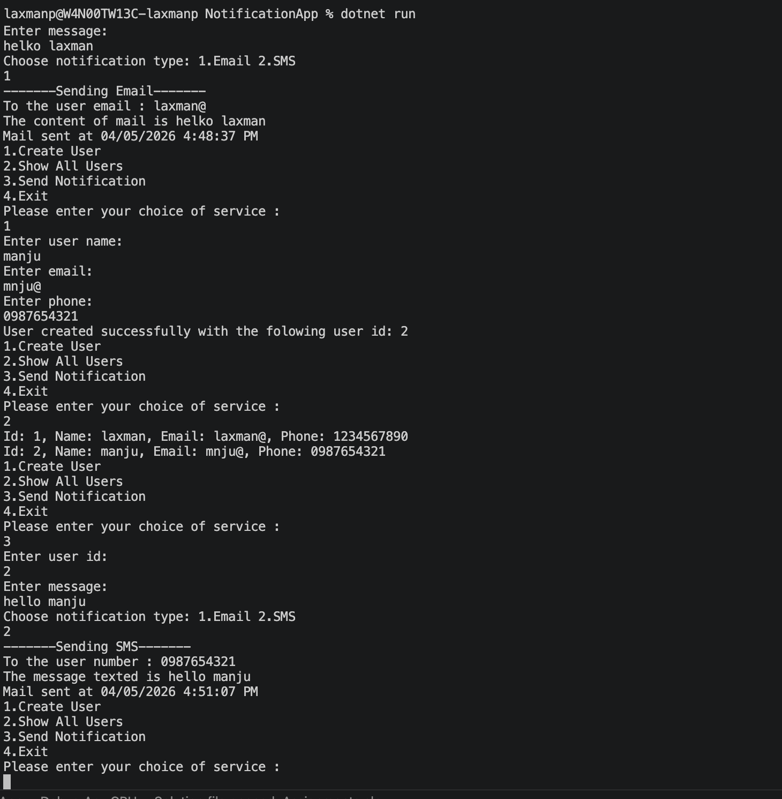

# NotificationApp

It is built to demonstrate basic OOP concepts such as abstraction, inheritance, polymorphism, and encapsulation.

## Features

- Create a user with name, email, and phone number
- Display all saved users
- Send a notification to a selected user
- Supports Email and SMS notification types

## How It Works

The app starts with a menu-driven console interface:

1. Create User
2. Show All Users
3. Send Notification
4. Exit

User data is stored in memory during runtime, and notifications are handled through a common interface.

## OOps Concepts Used

- Abstraction - the app uses `INotificationInteract` to define the service contract
- Encapsulation - user and notification data are grouped inside model classes
- Inheritance - `EmailNotification` and `SmsNotification` extend the base `Notification` class
- Polymorphism - notifications are sent through the base type, with each class providing its own `Send` behavior
- Enumeration - `NotificationType` clearly represents the available notification modes

## Output Screenshot

